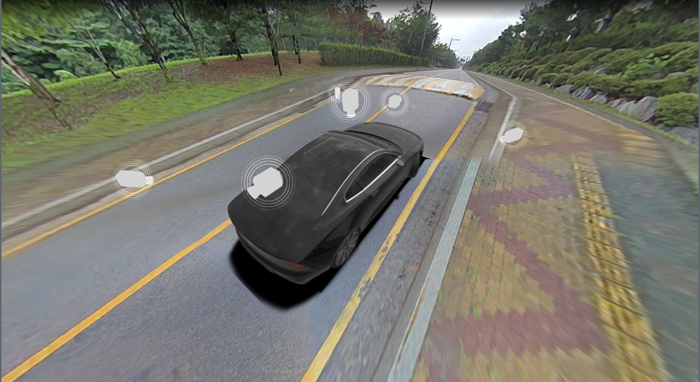

# cudaSV

`cudaSV` is a CUDA-first surround-view renderer that stitches four camera inputs and composites them with a CUDA-rasterized 3D vehicle scene.

The sample app renders a public four-camera pack with a glTF vehicle model, soft underlay/shadow, interactive viewpoint controls, and a CUDA post-process composition path.

# Demo



Expected result after running the sample: a desktop window opens with the stitched surround-view image, rendered vehicle, vehicle shadow/underlay, and clickable 3D viewpoint controls. Frame dumps are written to the path passed with `--dump-frame`.

# What It Demonstrates

- CUDA-based surround-view projection from four camera frames.
- A CUDA tile/bin rasterizer for the 3D scene.
- glTF-style metallic-roughness PBR shading for the vehicle model.
- Mipmapped material texture sampling with derivative-based LOD selection.
- Opaque, translucent, visibility-buffer, and UI-overlay render paths.
- Canonical four-camera rig loading with fisheye projection support.
- A small public sample pack for local build/run validation.

# System Requirements

The project builds and runs as a Linux desktop CUDA/OpenGL ES application.

Build tools:

- CMake 3.16 or newer.
- Make, via the `scripts/set_workspace.sh` workflow.
- A C++20-capable host compiler compatible with the installed CUDA Toolkit.
- CUDA Toolkit with `nvcc`.
- An NVIDIA driver new enough for the installed CUDA Toolkit.

GPU/runtime:

- NVIDIA GPU with CUDA support.
- CUDA runtime and driver libraries.
- The default CMake CUDA architecture is `89`; set `CMAKE_CUDA_ARCHITECTURES` explicitly if building for another GPU generation.

System libraries discovered by CMake:

- EGL.
- OpenGL ES 3.
- GLFW 3.
- GLM.
- FFmpeg libraries: `libavformat`, `libavcodec`, `libavutil`, `libswscale`.

Vendored third-party code includes `spdlog`, `nlohmann/json`, and `tinygltf`.

# Quickstart

Clone with submodules:

```bash
git clone --recurse-submodules <repo-url> cudaSV
cd cudaSV
```

If the repository was already cloned without submodules:

```bash
git submodule update --init --recursive
```

Install typical Ubuntu dependencies:

```bash
sudo apt update
sudo apt install \
  build-essential \
  cmake \
  git \
  make \
  pkg-config \
  ffmpeg \
  libavcodec-dev \
  libavformat-dev \
  libavutil-dev \
  libswscale-dev \
  libegl1-mesa-dev \
  libgles2-mesa-dev \
  libglfw3-dev \
  libglm-dev
```

Install the NVIDIA driver and CUDA Toolkit separately if they are not already available. The build expects `nvcc` on `PATH` or under a standard CUDA installation such as `/usr/local/cuda/bin`.

Build:

```bash
source scripts/set_workspace.sh
b
```

Run the public sample pack:

```bash
cd assets/sample_pack_4cam
source ../../scripts/set_workspace.sh
sv_app --frames right.png left.png front.png rear.png \
       --rig canonical-rig.json \
       --width 1920 \
       --height 1080
```

Dump a rendered frame:

```bash
sv_app --frames right.png left.png front.png rear.png \
       --rig canonical-rig.json \
       --width 1920 \
       --height 1080 \
       --dump-frame /tmp/cudasv.png \
       --dump-frame-number 8
```

The sample pack also has a launcher:

```bash
cd assets/sample_pack_4cam
./run.sh
```

Workspace build options can be changed in the sourced shell before running `b`:

```bash
set_build_type Release
set_cuda_profiling off
set_cuda_sanitizer off
set_taa on
set_force_affine_barycentrics off
b
```

Supported workspace options:

| Command | Values | Default | CMake option |
| --- | --- | --- | --- |
| `set_build_type` | `Debug`, `Release`, `RelWithDebInfo`, `MinSizeRel` | `Debug` | `CMAKE_BUILD_TYPE` |
| `set_cuda_profiling` | `on`, `off` | `off` | `WITH_PROFILE_CUDA_TIME` |
| `set_cuda_sanitizer` | `on`, `off` | `off` | `WITH_CUDA_COMPUTE_SANITIZER` |
| `set_taa` | `on`, `off` | `on` | `WITH_TAA` |
| `set_force_affine_barycentrics` | `on`, `off` | `off` | `CUDARF_FORCE_AFFINE_BARYCENTRICS` |

`b` re-runs CMake with the selected workspace option values each time.

Clean build output:

```bash
source scripts/set_workspace.sh
c
```

# Debug And Test Runs

The sample app also has targeted debug paths for renderer validation. These are not part of the normal demo or benchmark flow.

Run the public sample with the mip-checker GLB scenario:

```bash
cd assets/sample_pack_4cam
source ../../scripts/set_workspace.sh
sv_app --frames right.png left.png front.png rear.png \
       --rig canonical-rig.json \
       --width 1920 \
       --height 1080 \
       --test-scenario ../cudarf_test/mip-checker.json \
       --dump-frame /tmp/cudasv-mip-checker.png \
       --dump-frame-number 1
```

Enable bin-tiler validation output for a Debug build:

```bash
cd assets/sample_pack_4cam
source ../../scripts/set_workspace.sh
set_build_type Debug
b
sv_app --frames right.png left.png front.png rear.png \
       --rig canonical-rig.json \
       --width 1920 \
       --height 1080 \
       --debug-bin-tiler \
       --dump-frame /tmp/cudasv-bin-tiler.png \
       --dump-frame-number 1
```

`--debug-bin-tiler` copies bin-tiler buffers back to the CPU, synchronizes the CUDA stream, and validates the GPU bin assignments against CPU-side bin/triangle intersection checks while printing per-bin statistics. It is compiled only when `NDEBUG` is not defined, so use it with the default `Debug` build type.

# Controls

- Hold the left mouse button and move the mouse to pan the active view.
- Right-click a viewpoint control in the 3D view to activate that viewpoint.
- Use the mouse wheel to zoom when the active viewpoint supports it.

# Architecture Overview

The runtime is split into a small app layer, a surround-view engine layer, and a CUDA rendering layer:

- `src/sv_app/`: sample desktop app, CLI, config loading, and source setup.
- `src/sv_engine/`: scene/view orchestration, vehicle state, camera rig use, surround-view composition flow, and overlays.
- `src/rf/`: CUDA rasterizer, scene rendering, material loading, image-based lighting, and surround-view projection support.
- `src/engine_interface/`: shared runtime types and public configuration structures.
- `assets/sample_pack_4cam/`: public four-camera sample assets and config.
- `scripts/`: developer workflow helpers such as build environment setup.

High-level render flow:

1. Load the canonical rig and four synchronized camera frames.
2. Project camera frames into the surround-view framebuffer.
3. Render the vehicle scene and shadow/underlay into scene framebuffers.
4. Render viewpoint UI/control overlays in a separate UI pass.
5. Compose stitched image, scene, and UI into the final output.

See `docs/architecture.md` for the longer architecture note.

# CUDA Renderer Highlights

The renderer uses CUDA as the main execution substrate, not as a small helper around a conventional graphics renderer.

Active renderer features include:

- CUDA camera projection and surround-view stitching.
- Draw-packet based mesh submission into the CUDA raster pipe.
- Bin tiling, coarse tiling, triangle setup, and fine raster stages.
- Opaque and translucent raster paths.
- Visibility-buffer path with material-pass shading for opaque geometry; see `docs/visibility_buffer.md`.
- Separate UI overlay framebuffer for selection/viewpoint controls.
- TAA-aware scene output path.
- glTF-style metallic-roughness PBR shading.
- Base-color, normal, emissive, and metallic-roughness texture support.
- CUDA-side mip generation for loaded material textures.
- Explicit mipmapped texture sampling with derivative-based LOD selection for the active material texture path.
- Image-based lighting using spherical-harmonics diffuse plus prefiltered specular cubemap and BRDF LUT.

# Current Limitations

- The public runtime bridge assumes exactly four cameras: `right`, `left`, `front`, and `rear`.
- Public sample input is PNG-based.
- The rasterizer is not a complete glTF renderer; it implements the material features needed by the demo path.
- General triangle clipping is incomplete: fully outside triangles are rejected, but partially clipped triangles are not split against frustum planes.
- Some guard-band/sample-edge cases and warning cleanup remain to be done.

# Benchmarks

Public sample benchmark, using `assets/sample_pack_4cam` with the canonical rig and camera/view configuration. Timings are CUDA-event averages from the built-in profiler on frame 40, after a 40-frame warmup/dump run. Build: `Release`, CUDA profiling enabled, TAA disabled. See `docs/benchmarks.md` for the methodology and interpretation.

| GPU | Driver / CUDA | Resolution | Scene path | Surround-view projection | Scene render | Compose | Total frame time |
| --- | --- | --- | --- | ---: | ---: | ---: | ---: |
| NVIDIA GeForce RTX 4090 Laptop GPU | 575.57.08 / 12.9.41 | 1920 x 1080 | Visibuf opaque, TAA off | 0.27 ms | 3.27 ms | 0.11 ms | 3.66 ms |
| NVIDIA GeForce RTX 4090 Laptop GPU | 575.57.08 / 12.9.41 | 1920 x 1080 | Opaque raster, TAA off | 0.27 ms | 3.21 ms | 0.11 ms | 3.59 ms |

`Scene render` includes opaque, translucent, and UI-overlay draw-list rendering. `Total frame time` is the instrumented GPU time for the 3D view path (`view_3d_total`); it excludes source image decode, GLFW presentation, and PNG dump overhead.

# Dataset And Sample Assets

The public sample pack lives in `assets/sample_pack_4cam/` and includes:

- `canonical-rig.json`: four-camera canonical rig.
- `right.png`, `left.png`, `front.png`, `rear.png`: sample input frames.
- `config/vehicle.json`: vehicle dimensions and vehicle-state parameters.
- `config/overlays.json`: vehicle model, controls, underlay, and renderer overlay config.
- `config/views.json`: 3D view and viewpoint configuration.
- `run.sh`: sample launcher.

# Docs

Reference docs and schemas:

- `docs/architecture.md`: runtime and rendering architecture overview.
- `docs/schema/rig.schema.json`: canonical camera rig schema.
- `docs/camera_rig_debug.md`: camera-rig validation and debug notes.
- `docs/nuscenes-inspector.md`: NuScenes inspector controls and integration notes.
- `docs/visibility_buffer.md`: direct opaque path vs visibility-buffer opaque path.
- `docs/benchmarks.md`: benchmark methodology, commands, and interpretation.

Important sample/config files:

- `assets/sample_pack_4cam/canonical-rig.json`.
- `assets/sample_pack_4cam/config/vehicle.json`.
- `assets/sample_pack_4cam/config/overlays.json`.
- `assets/sample_pack_4cam/config/views.json`.

# License And Third-Party Notices

This repository is distributed under the GNU General Public License v3.0. See `LICENSE`.

Some source files retain upstream third-party notices, especially in the CUDA rasterization path derived from NVIDIA / `cudaraster` work. See `THIRD_PARTY_NOTICES.md` and individual file headers for details.

Third-party source dependencies are vendored as submodules under `thirdparty/`:

- `thirdparty/json`.
- `thirdparty/spdlog`.
- `thirdparty/tinygltf`.

